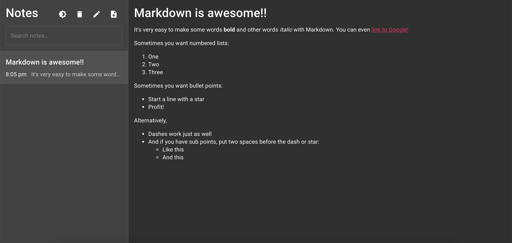

# Notes App

Note taking app built using [TypeScript](https://github.com/microsoft/TypeScript) and [React](https://github.com/facebook/react). The app supports writing Markdown notes with a live preview. Dark and light modes are also included.

The UI is implemented with [Material-UI](https://github.com/mui-org/material-ui) components. Notes are stored locally per browser using [IndexedDB](https://developer.mozilla.org/en-US/docs/Web/API/IndexedDB_API) and [Dexie.js](https://github.com/dfahlander/Dexie.js) for unlimited storage.

## Local development

The app uses [Yarn](https://github.com/yarnpkg/berry) for package management. You can install it by running:

```fish
npm install -g yarn
```

### Install dependencies

```fish
yarn install
```

### Run the app in development mode

```fish
yarn start
```

### Bundle the app in production mode

```fish
yarn build
```

### Run the app locally with Docker

```fish
docker build -t notes-app:0.1.0 .
docker run -d -p 5000:5000 notes-app:0.1.0
```

## Examples

### Writing a note


### Viewing a note



### Light mode


